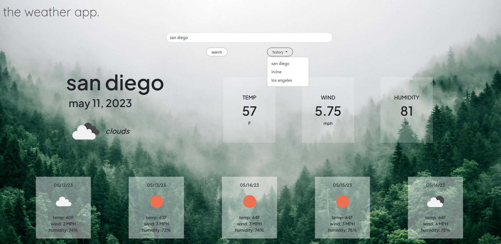

# Module 6 Challenge - The Weather App

## Description

This is a weather app that can be used to look up different cities and retrieve information about the current weather in that city and its 5-day forecast. 

## Usage/Preview

Users are able to search for cities by name and receive information on the current weather in that city and the weather for the upcoming 5 days. Each valid search is stored in the search history which persists through sessions with the use of local storage. Clicking on a search history item will bring up the weather information for that city.

Invalid searches notify the user that the city they inputted could not be found, and users will be allowed to search for a different city. 

Live: https://irene-panis.github.io/weather-app/

## Technologies Used
* jQuery
* Day.js for date conversion/formatting
* OpenWeatherMap API to source weather/forecast information
* Bootstrap

## Credits

N/A

## License

N/A